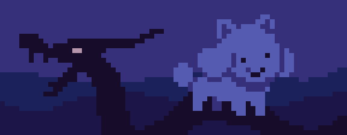
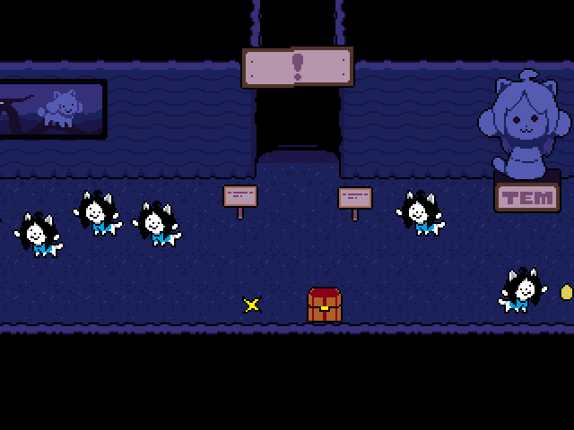
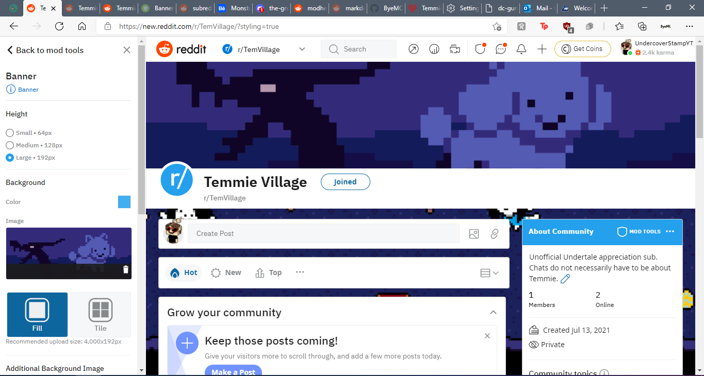
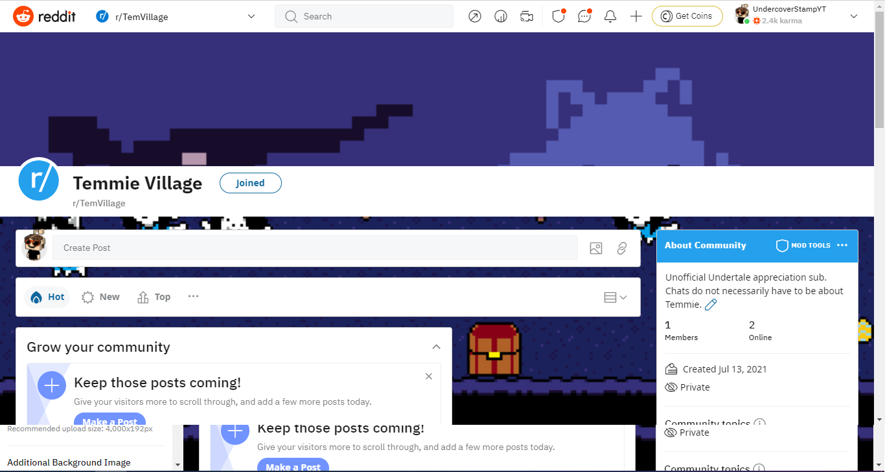
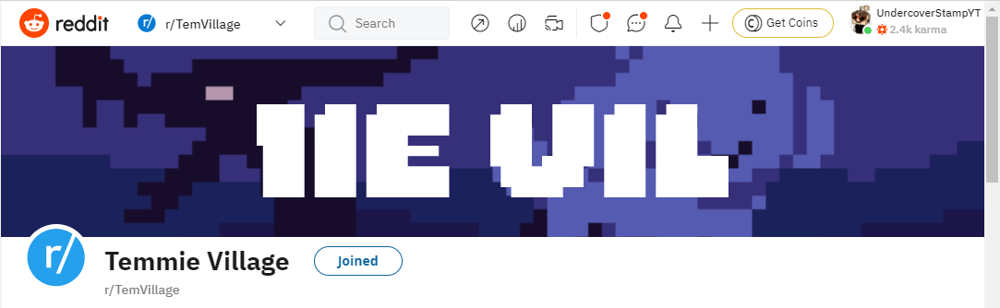
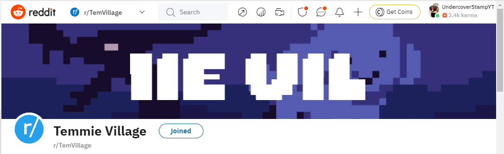

# I Need Help
## r/TemVillage
### Assets

#### Banner

Hello r/modhelp! Thanks for helping me. * if you are not from r/modhelp, welcome anyway!

These are two assets I'm using for [r/TemVillage](https://new.reddit.com/TemVillage). Note that last link was new Reddit. *That's* what these assets are for, and *that's* a giant pain in my ass.

I also have a [logo kinda thing, to which I also have a problem](#bannerlogo), but I've sectioned that off.

Anyway, in Reddit's design screen, it shows mainly correctly (when uploaded):

But when saved [or the design page is reloaded]...

Is there a template? *please yes*

#### BannerLogo

I have the same problem with the following files, too. It's using the "Additional Background Image" setting, which I have no clue how to use. It doesn't show correctly *anywhere*.

##### Files

##### Result

First file:

Second File:

